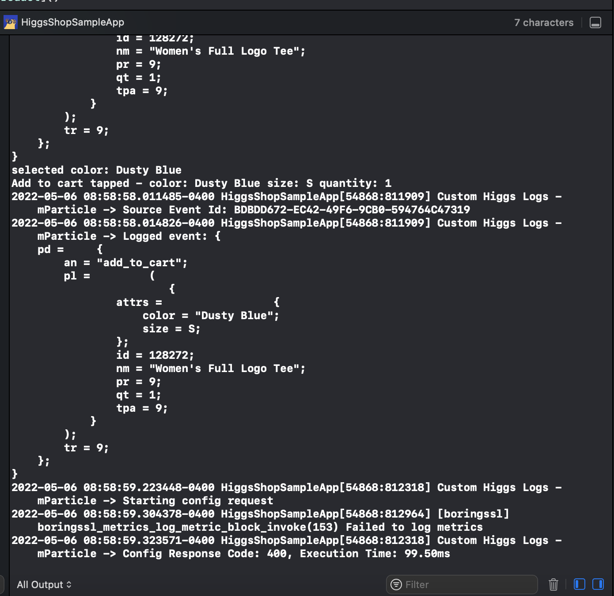

<br>


# The HiggsMart Sample App
:wave: Hello and welcome to HiggsMart! This sample iOS application will provide you with a hands-on way to understand how mParticle collects and forwards data, so you can easily implement data collection in your own projects. Throughout this application, the mParticle Apple and Media SDK have been set up to capture user events and identities and forward them to mParticle.

By using this sample app, you will quickly learn how to:

- Collect and forward data with mParticle

- View incoming data events and debugging information in real time

- Implement data collection with mParticle's SDKs

## Getting Started

1. Open `HiggsShopSampleApp.xcodeproj` in Xcode

2. Dependencies will automatically be updated by Swift Package Manager

3. In the `HiggsShopSampleApp` scheme, update the `MPARTICLE_KEY` and `MPARTICLE_SECRET` environment variables from `REPLACEME` to your your mParticle iOS API Key and secret.

-   If you do not have an iOS API key, visit your [mParticle Workspace](https://app.mparticle.com/setup/inputs/apps) to generate API Credentials under "Getting Started"

4. Run the project using the `Command-R`

This will spawn a simulator and open the Higgs Shop Sample App.

## Events used in this app

To make things simple yet declarative, this application has been built in such a way to keep event tracking close to the components that might logically trigger them rather than a fully DRY implementation. We've opted to be more repetitive so examples are consise and documented as necessary.

Please feel free to also visit our [Doc Site](https://docs.mparticle.com/) to gain more familiarity with some of the more advanced features of mParticle.

### Screen Views

In cases where it is necessary to track visitors as they navigate your iOS Application, mParticle offers [Screen Tracking](https://docs.mparticle.com/developers/sdk/ios/screen-tracking/).

In this Sample App, screen views each fire a single _Screen View_ when the component is rendered.

For example

```swift
// Renders an initial cart view when the screen loads
MParticle.sharedInstance().logScreen("View My Cart", eventInfo: ["number_of_products": numberOfProducts, "total_product_amounts": subTotal])
```

In some cases, we fire a _Commerce Event_ instead of a _Screen View_ to track more e-Commerce related attributes.

### Custom Events

Most often, you will need to use [Custom Events](https://docs.mparticle.com/developers/sdk/ios/event-tracking/#custom-events) to track events in a way that is unique to your use case. mParticle provides types of _Custom Events_ ranging from Navigation Events to Social Media Engagement and are mostly used to organize your data in a way that makes sense to you.

Many of our views make use of these events, for example, in the `LandingViewController` Component.

```swift
// Logs an event to signify that the user clicked on a button
if let event = MPEvent(name: "Landing Button Click", type: .other) {
    MParticle.sharedInstance().logEvent(event)
}
```

### Commerce Events

This Sample App emulates a simple e-Commerce application and makes heavy use of mParticle's [Commerce Events](https://docs.mparticle.com/developers/sdk/ios/commerce-tracking/).

Some events used in this application:

-   Add To Cart
-   Remove From Cart
-   Product Detail
-   Product Impression
-   Checkout
-   Purchase

Most _Commerce Events_ follow a similar pattern, requiring that you first generate an **mParticle Product** Object, which then gets passed into the `MPCommerceEvent` object.

You should map your own product attributes to be consistent with your [Data Plan](https://docs.mparticle.com/guides/data-master/introduction/) if you are leveraging that feature. Using Data Plans ensures data consistency within an app and across devices.

```swift
let mpProduct = MPProduct(name: name, sku: sku, quantity: quantity, price: price)
mpProduct.setUserDefinedAttributes(productAttributes)

let event = MPCommerceEvent.init(action: .addToCart, product: mpProduct)
MParticle.sharedInstance().logEvent(event)
```

Most Commerce Events are used within the following components:

-   `/HiggsShopSampleApp/ProductDetailViewController.swift`
-   `/HiggsShopSampleApp/CartViewController.swift`
-   `/HiggsShopSampleApp/CheckoutViewController.swift`

## Discovering Events

As a developer, sometimes the best way to learn is to just dig into the code or your debugging tools. To that end, this sample app ships verbose logging turned on, so that you can view details of what our SDK is doing within Xcode's console.

### Xcode Console



## Setting up an end-to-end data flow with HiggsMart and mParticle
mParticle simplifies the process of collecting customer data events from your apps, and forwarding this data to a wide variety of downstream systems for analytics, data processing, and marketing. To illustrate this process, here is an example of a data connection using HiggsMart as an input, and a sample output. 

Note: In this example, we will be using [Webhook.site](https://webhook.site) to simulate data transferring between the HiggsMart and your own services. Webhook.site is not an mParticle service and is only being used as to simulate an end-to-end full data flow to a third party system.

### Send data to mParticle
By generating your Apple API key and adding it to this project, you have already set up HiggsMart as a Apple input [input](https://docs.mparticle.com/guides/getting-started/create-an-input/). This means that your on-site behaviors in the local build of this app will be captured and sent to mParticle as data events. 

### View data events in real time
To see these data events coming in to mParticle real time, view the mParticle [Live Stream](https://docs.mparticle.com/guides/data-master/live-stream/) by navigating to **Data Master > Live Stream** in the mParticle UI.

Among other things, Live Stream allows you to: 

- Review incoming data to ensure correct SDK and/or server-to-server implementation

- Quickly identify and debug data collection errors

- Review outbound events to your connected integrations

- Test that your integrations are set up correctly

### Set up an output for your events
[Outputs](https://docs.mparticle.com/guides/getting-started/connect-an-event-output/#outputs) are destinations for data that you have collected with mParticle. These include 250+ integrations with leading platforms for analytics (like Indicative or Mixpanel), data processing services (like Amazon Kinesis), or marketing tools (like Braze or Appsflyer).

An output can also be a simple Webhook, however, and since this provides an easy way to set up a complete flow of data, a Webhook is what we'll use for this example. To set up a Webhook output in mParticle:

1. Navigate to **Setup > Inputs** in the left column of your mParticle Workspace.

2. Click the "Add Event Output" button in the top-right corner of the UI.

3. Select "Webhooks" from the dropdown.

4. Enter the configuration name “Apple Sample App”

5. Open [Webhook.site](https://www.webhook.site) in a new browser tab and copy your Webhook's unique URL.

6. In mParticle, paste the unique URL in the "POST URL" field in the event configuration window, then click "Save."

### Create a connection between your input and output
A [connection](https://docs.mparticle.com/guides/platform-guide/connections/) is the combination of an input, an output, and the configuration information that determines how data should be shared between the two. To create a connection between HiggsMart and your Webhook:

1. Navigate to **Connections > Connect** in the left column of your mParticle Workspace.

2. Click "Apple Platform" to select the apple app input you just created.

3. Click "Connect Output" to view all available outputs.

4. Select the Webhooks group of connections, then click "Select Configuration."

5. Choose "Apple Sample App" from the dropdown, then click "Next."

6. Toggle the “Status” button to “Active,” then click “Add Connection” to create the connection.

### Review forwarded events
At this point, data should be flowing from your sample app, to mParticle, then finally out to your Webhook output. Let's test this to make sure it's working. Back in the **Data Master > Live Stream** view:

1. Click the "Message Direction" dropdown and select “Outbound.”

2. Go back to Webhook.site to view your request details

Here, you should see your events from mParticle arriving at their intended destination. And that's it! You have successfully collected and forwarded data with mParticle.

## Development Notes

This project uses [SnapKit](https://snapkit.io/) to simplify AutoLayout constraints.

We also use [SwiftLint](https://github.com/realm/SwiftLint) to format code automatically using `swiftlint --fix`.

Linting will be run as a build phase during Xcode builds if SwiftLint is installed. It's not required to have swiftlint installed for testing the Sample Apps, but you can install it if desired by running `brew install swiftlint`.

This can be helpful if you want to submit a Pull Request so you are aware of any potential lint issues before they are flagged by CI.

## Support

<support@mparticle.com>

## License

The mParticle Apple SDK is available under the [Apache License, Version 2.0](http://www.apache.org/licenses/LICENSE-2.0). See the LICENSE file for more info.
